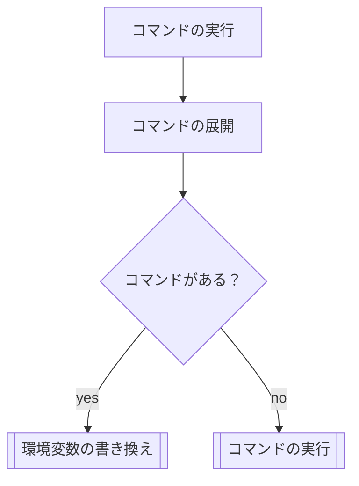
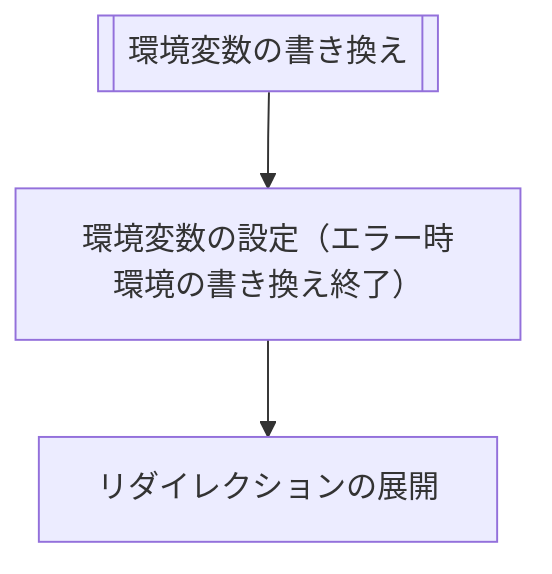
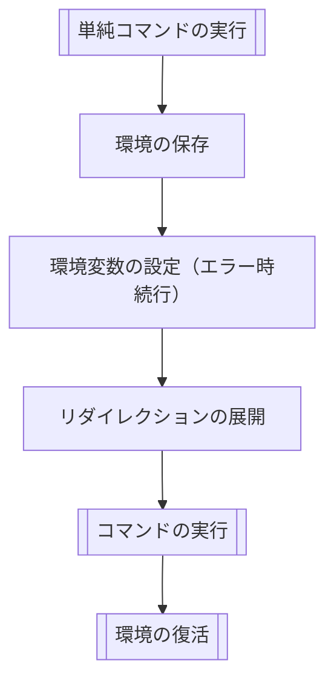

# 単純コマンドの実行
# 宣言
```c
int	ms_simple_command_execution(t_lsa_command *lsa);
```

# 説明
意味解析の結果からコマンドを実行する。
コマンドが存在有無によって挙動が異なる。

- コマンドがあるとき
	1. コマンドの展開
	2. FD(0,1,2)と環境変数の保存
	3. 環境変数の代入（エラー発生時でも処理を続ける）
	4. リダイレクションの実行
	5. コマンドの実行
	6. FD(0,1,2)と環境変数のリストア

- コマンドがないとき
	1. 環境変数の代入
	2. リダイレクションの実行

各処理はフローのセクションを参考にすること。

# 戻り値
- コマンドの実行の実行ができたとき、`ms_execute_command`関数の戻り値をそのまま返す。
- 環境変数の代入やリダイレクションで失敗して終了する必要があるときは、`1`を返す。
- メモリ不足でエラーが発生したときは、`-1`を返す。

# エラー
- ENOMEM メモリ不足で終了したとき

# フロー

単純コマンドは以下の順に処理が行われる。







# 主な関数
## 一覧
 | 関数名 | 意味 |
 | --- | --- |
 | ms_simple_command_execution | シンプルコマンドの実行 |
 | ms_has_any_commands | コマンドがあるかどうか |
 | ms_expand_commands | コマンドの展開 |
 | ms_overwrite_environ | 環境変数の上書き |
 | ms_save_environ_memento | 環境の保存 |
 | ms_restore_environ_memento | 環境の修復 |
 | ms_run_assignment_variables | 環境変数の代入を実行 |
 | ms_run_redirection | リダイレクションの実行 |
 | ms_execute_command | コマンドの実行 |
 > ここでは、環境と環境変数は別物として扱っています。
 > 環境（標準入出力のFDと環境変数）

 ## ms_has_any_commands (コマンドがあるかどうかの判定)
 - **宣言**:
 ```c
bool	ms_has_any_commands_of_expand(char **ntp)
 ```
 - **説明**: コマンドがあるかどうかを判定する。
 - **引数**:
	 - **ntp**: NULL終端の配列。
 - **戻り値**
	 - **true**: 一番目の要素に、長さが１以上の文字列が入っている時。
	 - **false**: それ以外の場合
 - **エラー**: なし

 ## ms_expand_commands (コマンドの展開)
- **宣言**:
```c
char	**ms_expand_commands(t_lsa_word_list **args);
```
- **説明**:
	- 引数のargsの各要素に対して、展開処理(ms_expansion)を行った結果を結合して、NULL終端の配列で返す。
- **引数**:
	- **args**: NULL終端の配列
- **戻り値**
	- **成功時**: NULL終端の配列
	- **失敗時**: NULL
- **エラー**:
  - **ENOMEM**: malloc関連のエラー

 ## ms_overwrite_environ (環境変数の書き換え)
 - **宣言**:
 ```c
 int ms_overwrite_environ(s_lsa_assignment **assignments);
 ```
 - **説明**:
	 - assignmentsから各代入式を実行して、グローバルな変数を書き換える。（内部で環境変数を渡して処理する同様の関数があると良さげ。）
 - **引数**:
	 - **assignments**: NULL終端の配列
 - **戻り値**
	 - **成功時**: 0を返す。
	 - **失敗時**: 1を返す。読み込み専用の変数に代入しようとしたとき等に失敗。
	 - **エラー時**: -1 を返し、errnoに値が設定される。
 - **エラー**:
	 - **ENOMEM**: malloc関連のエラー


 ## ms_save_environ_memento ( 実行環境の保存 )
- **宣言**:
```c
t_environ_memento *ms_save_exec_memento(char *const envp[]);
```
- **説明**:
以下の情報を構造体に複製して保存する。
	* 現在の標準入力のFD
	* 現在の標準出力のFD
	* 現在の標準エラー出力のFD
	* 現在の環境変数

	FDは、dup2を使って複製され、各FDは以下のFDに対応する。
	| 複製元のFD | 複製先のFD |
	| --- | --- |
	| 0 | 10 |
	| 1 | 11 |
	| 2 | 12 |

- **戻り値**
	- **成功時**: 複製された情報へのポインタ
	- **失敗時**: NULL
- **エラー**:
  - **ENOMEM**: malloc関連のエラー
  - **EBADF**: dup関連のエラー
  - **EMFILE**: dup関連のエラー
- **構造体**:
```c
// 実行環境の構造体（環境変数とはべつ）
typedef struct s_environ_memento {
	int	stdin_fd; // 標準入力のFD
	int	stdout_fd; // 標準出力のFD
	int	stderr_fd; // 標準エラー出力のFD
}	t_environ_memento;
```

 ## ms_restore_environ_memento （環境の修復）

 ## ms_run_assignment_variables（環境変数の代入を実行）
 - **宣言**:
 ```c
 int ms_run_assignment_variables(t_lsa_assignment **assignments);
 ```
 - **説明**:
 	 - 引数から環境変数の代入を実行し、環境変数の値を書き換える。
	 - valueは、展開処理（ms_expansion）を行ってから値を代入する。
	 - ワイルドカードの展開（*）で複数の展開が行われたときは、空白で結合して一つの文字列としてvalueとなる。
 - **引数**:
	 - **assignments**: 意味解析された、代入の情報
 - **戻り値**
	 - **1**: readonlyな変数に代入しようとしたとき。今回では発生予定はないし、判定可能ではないはず。
	 - **0**: 成功時
	 - **-1**: 致命的なエラー時、errnoに値が設定される。
 - **エラー**:
	 - **ENOMEM**: malloc関連のエラー

 ## ms_run_redirection (リダイレクションの実行)
 - **宣言**:
 ```c
 int ms_run_redirects(t_lsa_redirection **redirects);
 ```
 - **説明**:
 	 - 引数に格納されている情報をもとに、ファイルディスクリプタ（0, 1）を書き換える(dup2(2))。
 	 - ヒアドクの場合は、一時ファイル（mkstemp）に、heredoc_inputの値を出力し、そのファイルを読み込むことができるように、ファイルディスクリプタを書き換える。
	 - heredoc_inputに値を出力する際に、変数がある場合は、変数展開を行い出力する。
	 > mkstemp自作したのを渡すので、それ使ってください。多分バグはないはず・・・。
	 - 成功しなかったときは、エラーメッセージを出力を出力して終了する。
	 - filename_or_delimiterを展開処理する。ただし、ヒアドクの場合は、クォート削除のみを行い、変数展開やワイルドカード展開は行わない。
	 - filename_or_delimiterを展開処理を行った後に、ワイルドカードによって、複数のファイルに展開された場合は、エラーが発生し、エラーフォーマットに沿って次のようなメッセージを出力する。```-bash: *: ambiguous redirect```
 - **引数**:
	 - **redirects**: リダイレクト情報
 - **戻り値**
	 - **0**: 成功時
	 - **-1**: エラー時、フォーマットに従ってエラーメッセージを出力する。
 - **エラー**:
	 - **その他**: malloc, mkstemp, dup2, write, open, close等のエラー

 ## ms_execute_command (コマンドの実行)
 - **宣言**:
 ```c
 int ms_execute_command(char **args)
 ```
 - **説明**:
 * 現在の環境で、argsのコマンドを実行する。args[0]がコマンドとして認識され、args[1]以降は、引数として扱われる。
 * args[0]は、PATHが設定されいてかつ、`/`が含まれないときに、PATH変数を使って展開処理が行われる。
 * PATH変数を使って展開処理を行わない場合はそのままexecveに渡される。
 * specificationのPATH変数の内容を確認してください。
 * また、各argsはパラメータ展開(*)される必要があります。展開される対象は、クォートされていないもののみです。
 * コマンドが展開された後は、execveによって、実行されます。
 * より詳細な説明は、仕様（specification.md）を参考に作成してください。
 - **引数**:
	 - **args**: NULL終端の配列
 - **戻り値**
	 - **126**: execveがerrno, ENOENT, EFAULT以外で失敗したとき。
	 - **127**: 次の場合にこの番号で終了します。
		 - ENOENT, EFAULTで失敗したとき。
		 - コマンドのパスをPATH変数を使って展開した場合に、ファイルが存在しなかった場合。
		 - そのほかのエラーの場合。
	 - **成功時**: 戻り値無し
 - **エラー**:
     - 基本的にexecveのエラーを確認。
 - **エラーメッセージ**:
	 - 以下の場合に、エラー文のフォーマットに沿って、`command not found`を出力する。
	     - PATHを検索したが、対象のコマンドが見つからなかったとき。
	 - それ以外の時は、perrorに順ずるエラーメッセージをフォーマットに沿って出力する。
