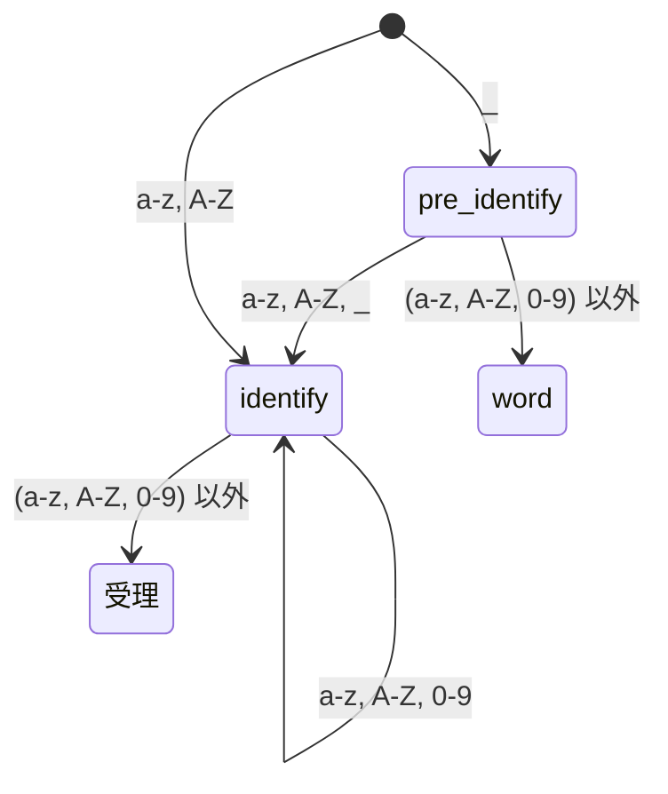
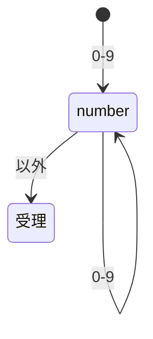
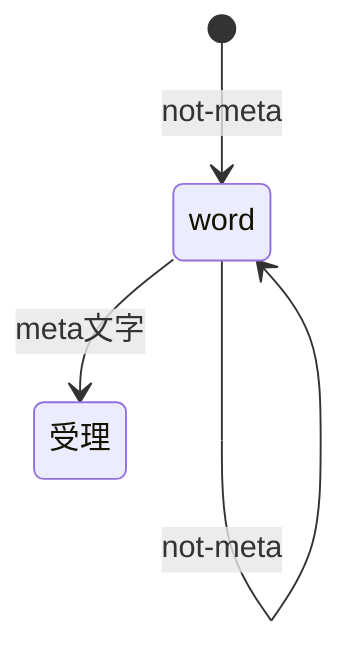
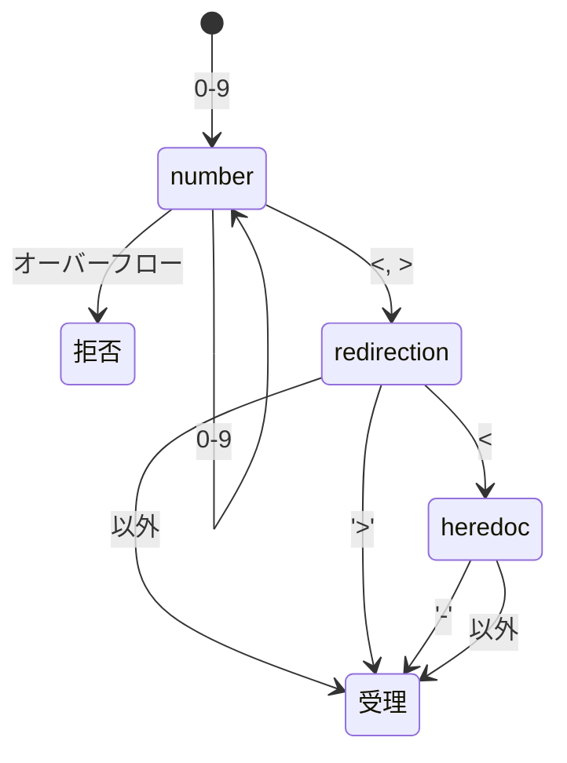
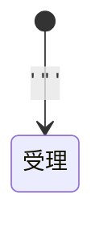
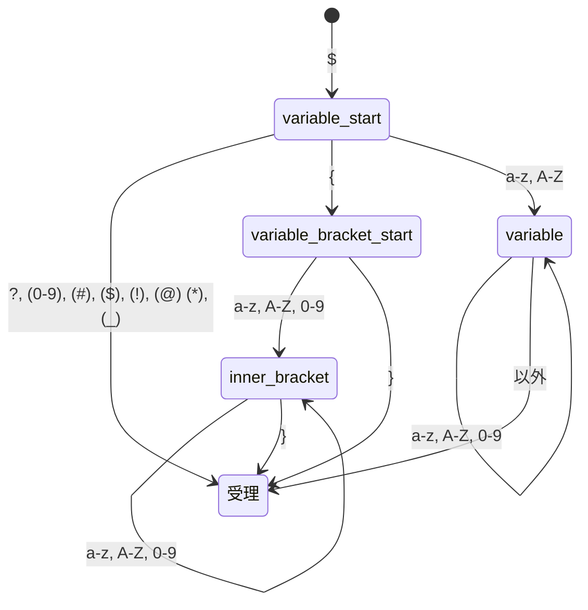
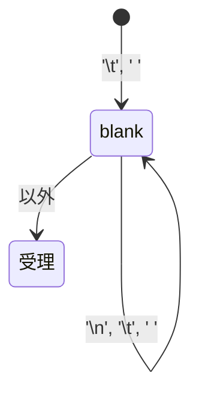
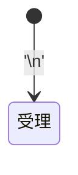
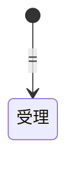
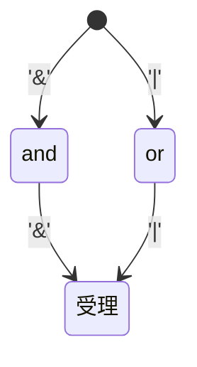

# 字句解析設計
# 宣言
`t_list *ms_lexical_analyze(const char *input)`

# 説明
　inputの文字列を字句解析を行い、トークン（単語）のリストを作成する。
トークンは下記の有限オートマトンによって判断される。
もしも複数のオートマトンで解釈可能な場合は、下記の優先度に従って一つに決定される。
一つのリスト(t_list)には一つのトークン(t_token)が入る。

対象のトークンは文字列として抜き出され、メモリにコピーされる。

もしも、一つもトークン可能な文字列がない場合は、拒否トークン(TK_DECLINED)が入ったリストが返される。

また、次のトークンは、t_token_optに、対応する構造体に設定すること。
* リダイレクション
* 変数

# 戻り値
成功した場合は、リストの先頭ポインタ。
失敗した場合は、NULLが返され、errnoに適切な値が設定される。

# エラー
ENOMEM　メモリ確保関連のエラーが発生した場合

# その他注意事項

* その他の関数セクションを参考に、オートマトンに従ったtokenize関数を実装すること。
* 優先度を判断する関数を作成すること。
* 構造体、関数宣言は、lexical_analyze.hに作成すること。
* 指定のある各関数の実装は、`関数名.c`のファイルに作成すること。(他は自由)

# メタ文字
ここでは、meta文字は次のうちのどれかを指すものとする：
	'<' '>' ' ' '\n' '\t' '=' ('&' '|' '(' ')' )

# トークンの分類一覧
 | 分類 | 意味 | t_token_type |
 | --- | --- | --- |
 | 拒否 | どのトークンにも当てはまらない | TK_DECLINED |
 | 識別子 | 環境変数代入時に指定できる名称 | TK_IDENTIFY |
 | 数値 | 数値 | TK_NUMBER |
 | ワード | 文字列 | TK_WORD |
 | リダイレクション | `< << <<- > >>` のどれか(数値を含む) | TK_REDIRECTION |
 | シングルクウォート | `'` | TK_SINGLE_QUOTE |
 | ダブルクォート | `"` | TK_DOUBLE_QUOTE |
 | 変数 | `$`から始まる特定の文字列。特殊変数含む | TK_VARIABLE |
 | パイプ | `|` | TK_PIPE |
 | 空白 | `\t\n ` のいずれかが連続する文字列 | TK_BLANK |
 | 改行 | `\n` | TK_NEWLINE |
 | 代入演算子 | `=` | TK_EQUALS |
 | (左カッコ) | `(` |  TK_LEFT_PARENTHESIS |
 | (右カッコ) | `)` のどれか |  TK_RIGHT_BRACKET |
 | (リスト) | `&& \|\|` のどれか | TK_LIST |

# 有限オートマトン
識別子


数値


ワード


リダイレクション


文字列リテラル(シングルクウォート)


ダブルクォート


変数
(カッコ内は、本家では変数として扱うが、今回は扱わないもの)


パイプ


空白


改行


代入演算子


（左カッコ）
```mermaid
	[*] --> 受理: '('
```

（右カッコ）
```mermaid
	[*] --> 受理: ')'
```

（リスト）


# 優先度

優先度は、3つの判断基準よって順に決定される。
1. 種別による優先度
2. トークン（単語）の長さ
3. 種別内の優先度
順に判断され、同じ優先度だった場合、次の判断基準で判断される。

種別内の優先度は、左にあるものの方が高いものとする。

**種別による優先度**
|優先度| 対象 |
|---|---|
|高| --- |
|--| 変数, リダイレクション, シングルクォート, ダブルクォート, パイプ, （リスト）, 空白文字, 代入演算子, 改行文字, （左かっこ）, (右かっこ), 数値 |
|--| 識別子, ワード |
|--| 拒否 |
|低| --- |

**トークンの長さ**
より長いものが優先度が高くなる。

**種別内の優先度**
種別による優先度の表の同じ優先度のものに対して、左にあるものが優先度が高い。

**オートマトンに従って計算される場合の判断例**
| 入力値 | トークンの種類 | 優先度によって決定されたトークンの種類 | 決定事由 |
| --- | --- | --- | --- |
| `$Abs` | ワード　変数 | 変数 | 種別による優先度 |
| `Abs#` | 識別子(`Abs`)　ワード(`Abs#`) | ワード | トークンの長さ |
| `Abs ` | 識別子(`Abs`)　ワード(`Abs`) | 識別子 | 種別内の優先度 |

# 構造体
```c
// トークンの種類
typedef enum e_token_type {
	TK_DECLINED, // 拒否 (対象のオートマトンでは解析できなかった)
	TK_IDENTIFY, // 識別子
	TK_NUMBER, // 数値
	TK_WORD, // ワード
	TK_BLANK, // 空白文字 '\t '
	TK_NEWLINE, // 改行文字 '\n'
	TK_VARIABLE, // 変数
	TK_PIPE, // '|'
	TK_EQUALS, // '='
	TK_SINGLE_QUOTE, // '
	TK_DOUBLE_QUOTE, // "
	TK_REDIRECTION, // < << <<- > >>
	TK_LEFT_PARENTHESIS, // '('
	TK_RIGHT_PARENTHESIS, // ')'
	TK_LIST, // && ||
}	t_token_type;

// トークン
typedef struct s_token {
	t_token_type	type;
	char			*token; // メモリに確保された文字列
	int				end_pos; // 入力文字列に対する、トークン外の文字の開始位置
	int				start_pos; // 入力文字列に対する、トークンの開始位置
}	t_token;

```

# その他の関数

## tokenize系
### 共通
**宣言** `t_token *ms_tokenize_*(const char *input, int pos)`の形で統一されている。

**説明**
inputのposから始まる文字列に対して、
対象のトークンかどうかをオートマトンと構造体を元に処理し、t_tokenへのポインタを返す。
オートマトンで受理できない場合は、実引数の初期値を`ms_tokenize_declined`に渡し、呼び出した結果を返す。

**引数**
inputは、入力文字列。
posは、判断するトークンの最初の文字列。

**戻り値**
成功時、メモリに確保されたt_token型へのポインタ。
失敗時、NULL

**エラー**
ENOMEM メモリ確保関連のエラー

### 関数名一覧
* ms_tokenize_declined
* ms_tokenize_identify
* ms_tokenize_word
* ms_tokenize_blank
* ms_tokenize_newline
* ms_tokenize_variable
* ms_tokenize_pipe
* ms_tokenize_equals
* ms_tokenize_single_quote
* ms_tokenize_double_quote
* ms_tokenize_redirection
* ms_tokenize_left_parenthesis
* ms_tokenize_right_parenthesis
* ms_tokenize_list

### ms_tokenize_declined
拒否トークンの生成を行う。
start_posとend_posには、同じ値が入る。

## 優先度関数
**宣言**
`int ms_token_priority_cmp(t_token *left, t_token *right)`

**説明**
tokenの優先度を比較して結果を返す。
優先度は、*優先度*のセクションを参照してください。

NULLが指定された場合は、最も低い優先度のtokenとして扱う。

**戻り値**
* `left > right` の場合、正の値
* `left < right` の場合、負の値
* `left == right` の場合、0

**エラー**
なし
# 参考

字句解析に置いて、有限オートマトンと言われるものが使用されるらしく、また字句解析に使用できそうなため、これを利用する。
[wiki 字句解析](https://ja.wikipedia.org/wiki/%E5%AD%97%E5%8F%A5%E8%A7%A3%E6%9E%90)
[字句解析に関する説明がわかりやすい](http://p-www.iwate-pu.ac.jp/~wjh/lectures/lctp/chap-3.pdf)

また、数字から数値へのトークン化に置いて、字句解析中に数値化するようなので、それを視野に入れて設計を見直す。
[実際のコードがわかりやすい](https://atmarkit.itmedia.co.jp/ait/articles/0705/15/news135_3.html)

ネットに乗っているほとんどの字句解析や構文解析は簡単なものが多い気がする‥‥？
字句解析をより丁寧に行って、構文解析の簡略化に進む。

頭の中が整理できないので、空白のトークン化も行う。

有限オートマトンを作成した。（字句解析に使う状態遷移とトークン化のタイミングを以下のグラフで示す。）
