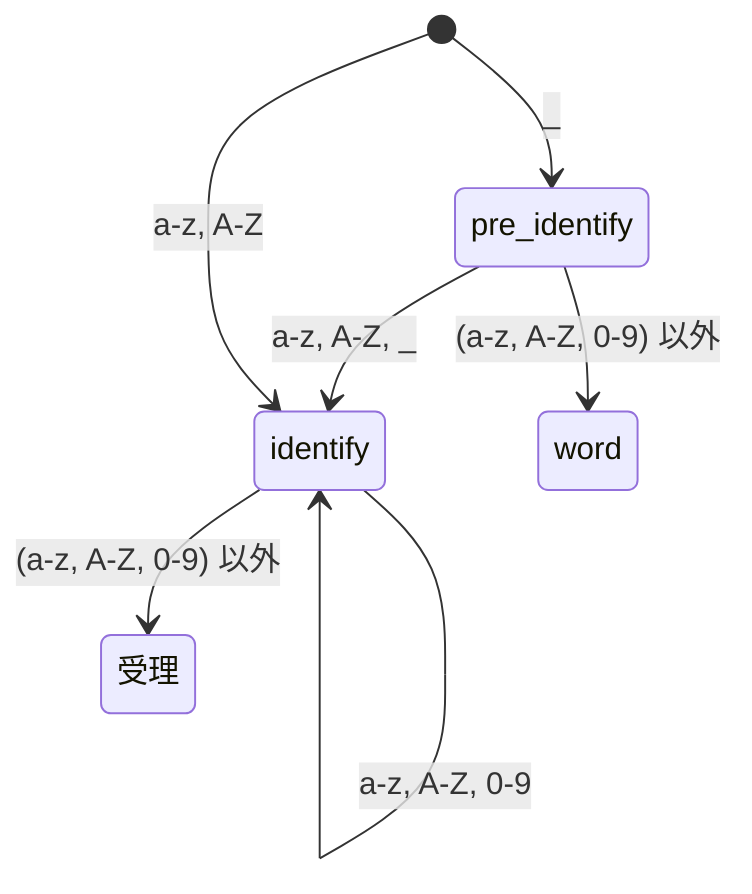
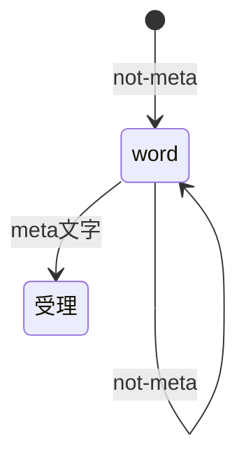
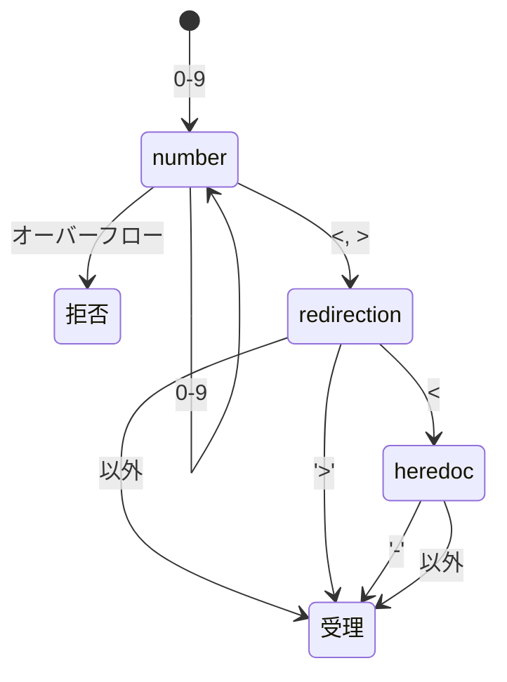
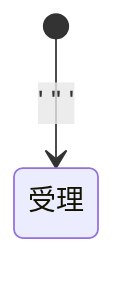
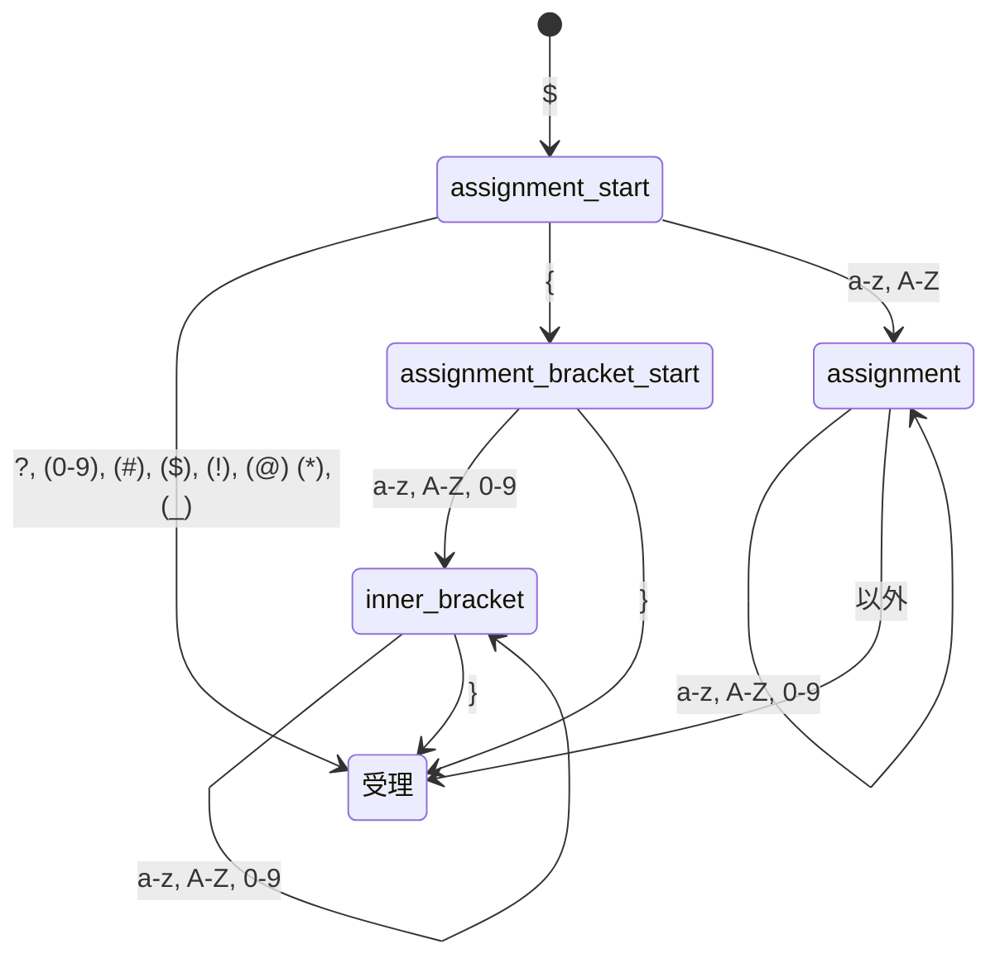
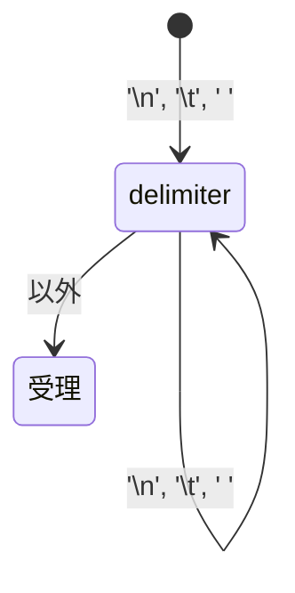
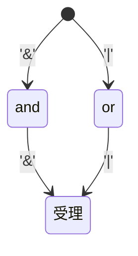

# TODO
1. '='のオートマトンを追加する。
2. オートマトンが足りているかどうかを調査する。
3. 宣言と説明、エラーを作成する。
4. その他の関数と説明を簡単に追加する。

# メタ文字
ここでは、meta文字は次のうちのどれかを指すものとする：'<' '<<' '<<-' '>' '>>' ' ' '\n' '\t' '=' '&&' '||'
ここでは、簡単のためリストは作成していないが、実際の設計時には含める予定。

# 分類一覧
 | 分類 | 意味 |
 | --- | --- |
 | 識別子 | 環境変数代入時に指定できる名称 |
 | ワード | 文字列 |
 | リダイレクション | `< << <<- > >>` のどれか(数値を含む) |
 | シングルクウォート | `'` |
 | ダブルクォート | `"` |
 | 変数 | `$`から始まる特定の文字列。特殊変数含む |
 | パイプ | `|` |
 | 区切り文字 | `\t\n ` のいずれかが連続する文字列 |

# 有限オートマトン
識別子


ワード


リダイレクション


文字列リテラル(シングルクウォート)


ダブルクォート


変数
(カッコ内は、本家では変数として扱うが、今回は扱わないもの)


パイプ


区切り文字


（リスト）


# 優先度
優先度
|優先度| 対象 |
|---|---|
|高| --- |
|0| 変数, リダイレクション, シングルクォート, ダブルクォート, パイプ, （リスト）, 区切り文字 |
|1| 識別子, ワード |
|低| --- |

# 構造体
```c
typedef enum e_token_type {
	TK_DECLINED, // 拒否 (対象のオートマトンでは解析できなかった)
	TK_IDENTIFY, // 識別子
	TK_WORD, // ワード
	TK_DELIMITER, // 区切り文字 '\t\n '
	TK_VARIABLE, // 変数
	TK_PIPE, // '|'
	TK_SINGLE_QUOTE, // '
	TK_DOUBLE_QUOTE, // "
	TK_REDIRECTION, // < << <<- > >>
	// TK_LIST_AND, // &&
	// TK_LIST_OR, // ||
}	t_token_type;

typedef enum e_redirection_type {
	RD_INPUT, // <
	RD_OUTPUT, // >
	RD_APPEND, // >>
	RD_HEREDOC, // <<
	RD_HEREDOC_VAR, // <<-
}	t_redirection_type;

typedef struct s_token {
	t_token_type type;
	char	*token;
	int		end_pos; // 入力文字列に対する、トークン外の文字の開始位置
	int		start_pos; // 入力文字列に対する、トークンの開始位置
	void *opt;
	void (*free_opt)(void *);
	void (*print_opt)(void *);
}	t_token;

typedef struct s_redirection {
	t_redirection_type type;
	int fd;
}	t_redirection;


```
# 参考

字句解析に置いて、有限オートマトンと言われるものが使用されるらしく、また字句解析に使用できそうなため、これを利用する。
[wiki 字句解析](https://ja.wikipedia.org/wiki/%E5%AD%97%E5%8F%A5%E8%A7%A3%E6%9E%90)
[字句解析に関する説明がわかりやすい](http://p-www.iwate-pu.ac.jp/~wjh/lectures/lctp/chap-3.pdf)

また、数字から数値へのトークン化に置いて、字句解析中に数値化するようなので、それを視野に入れて設計を見直す。
[実際のコードがわかりやすい](https://atmarkit.itmedia.co.jp/ait/articles/0705/15/news135_3.html)

ネットに乗っているほとんどの字句解析や構文解析は簡単なものが多い気がする‥‥？
字句解析をより丁寧に行って、構文解析の簡略化に進む。

頭の中が整理できないので、空白のトークン化も行う。

有限オートマトンを作成した。（字句解析に使う状態遷移とトークン化のタイミングを以下のグラフで示す。）
