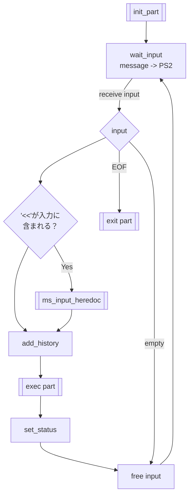
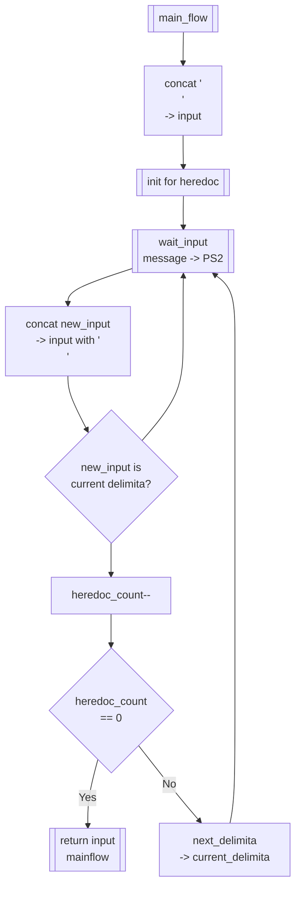

# input_from_cmdline

## main
 
### `void ms_input(t_minishell mnsh)`
- **説明**
	- ユーザーからの入力を受け取る
	- 入力値があるならば、下記処理を行い、入力値をヒストリーに格納してexec_partへ渡す。
		- "<<"が含まれる時、heredoc用の文字列を取得する挙動を行う
		- 括弧、クォーテーションの閉じ忘れなどは考慮せずに次へ渡す。
	- 入力値がEOFであれば終了処理を行う。
	- 入力値が空文字列であれば新しい行を出力する。
### 定義
- **input**
	- コマンドラインからの入力のこと。
	- ms_input_waitで出力した文字列。
	- ms_input_heredoc内の入力文字列は、mainflowとは違うinputを受け取って連結させているため、違う変数として扱う。

### データ構造 
``` c

typedef struct s_delimita_list{
	char *delimiter;
	struct *delimiter_list
}t_delimiter_list

typedef struct s_heredoc{
	size_t *heredoc_count;
	t_delimiter *delimiter_list;
}t_heredoc

```

- heredoc用の構造体変数
	`heredoc_count (Default = 0)`
	- heredocの個数を格納する。

	`t_heredoc_list`
	`t_heredoc`

	- heredoc中に入力された文字列を格納するリスト。
	- t_heredocのheadが最初のheredocを指す。 

	`t_delimita_list`
	- delimiterを格納するリスト。左から先頭に格納される。

### workflow


---
### `char *ms_input_heredoc(t_minishell mnsh,char *input)`
- **説明**
	- ヒアドキュメントとして扱う文字の処理を行う。
	- 初期化の際に併せてinputに改行を加える。
	- inputに各入力を改行文字と併せて加える。
- **戻り値**
	- コマンドラインから受け取った文字列を一行ずつ改行と併せて結合し、その結果を返す。
		``` bash
		$ << EOF << EOF2
		> aaa
		> EOF
		> EOF2

		// historyで参照した時
		$ << EOF << EOF2
		aaa
		EOF
		EOF2

		---
		```
	
### work_flow
