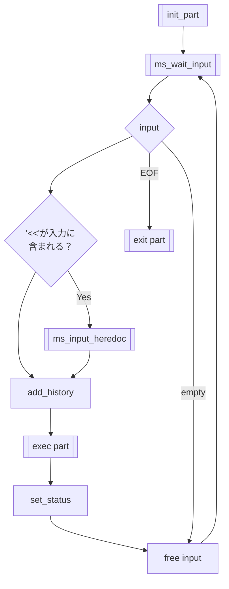
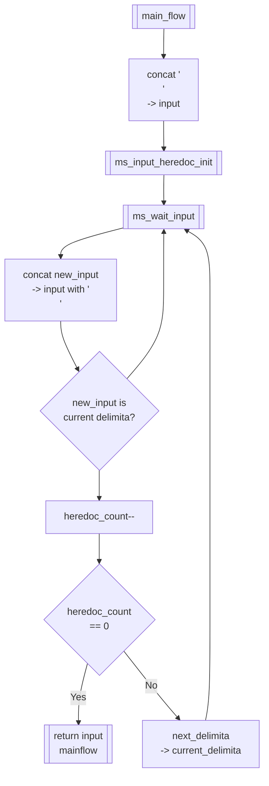

# input_from_cmdline

### !申し送り事項!　11/26 10:30
ms_input()の引数がまだ不明瞭（初期化の設計が固まっていないので）
クォート・括弧の閉じ忘れの処理、最悪いらないと思ったのでとりあえずなしで設計しました。
EMONEMを検知した時の挙動が掛けていない。（処理に関してあまり考えていなかった）

## main
 
### `void ms_input(t_minishell mnsh)`
- **説明**
	- ユーザーからの入力を受け取る
	- 入力値があるならば、下記処理を行い、入力値をヒストリーに格納してexec_partへ渡す。
		- "<<"が含まれる時、heredoc用の文字列を取得する挙動を行う
		- 括弧、クォーテーションの閉じ忘れなどは考慮せずに次へ渡す。
	- 入力値がEOFであれば終了処理を行う。
	- 入力値が空文字列であれば新しい行を出力する。
## Variable
`char *input`
- コマンドラインからの入力を格納する変数。
- ms_input_waitで出力した文字列を格納する。
- ms_input_heredoc内の入力文字列は、mainflowとは違うinputを受け取って連結させているため、違う変数名で名付けたほうが良い。

`int input_state (Default = 0)`
- プロンプト出力状態の確認に使う。
- **出力文字**
	- 0:PS1
	- 1:PS2

`int closing_flag (Default = 0)`
- クォート、括弧が閉じられているかどうか判別するフラグ。
- `"` `'` `(` `)` のような閉じる必要のある文字についてそれぞれビットフラグを立てて管理する。

	``` c

	typedef struct s_delimiter_list{
		char *delimiter;
		struct s_delimiter_list *next;
	}t_delimiter_list

	typedef struct s_heredoc{
		int heredoc_count;
		t_delimiter *delimiter_list;
	}t_heredoc
	```
- heredoc用の構造体変数
	`heredoc_count (Default = 0)`
	- heredocの個数を格納する。

	`t_heredoc_list`
	`t_heredoc`

	- heredoc中に入力された文字列を格納するリスト。
	- t_heredocのheadが最初のheredocを指す。 

	`t_delimiter_list`
	- delimiterを格納するリスト。左から先頭に格納される。

### workflow


### function
#### `char *ms_input_wait(t_minishell mnsh, int input_state)`
- **説明**
	- 入力待ちを行う変数`input_state`の値によって表示するプロンプトを変える
		- 0 : 通常の入力待ち
		- 1 : heredoc
	- readline関数から受け取った文字列を返す。
---
### `char *ms_input_heredoc(t_minishell mnsh,char *input)`
- **説明**
	- ヒアドキュメントとして扱う文字の処理を行う。
	- 初期化の際に併せてinputに改行を加える。
	- inputに各入力を改行文字と併せて加える。
	
### work_flow

### func 
#### `t_heredoc ms_input_heredoc_init(char *input)`
**説明**
- minishell情報を格納したt_heredoc構造体の初期化を行ったものを返す。
**エラー**
- EMONEM : メモリ割当に失敗した時