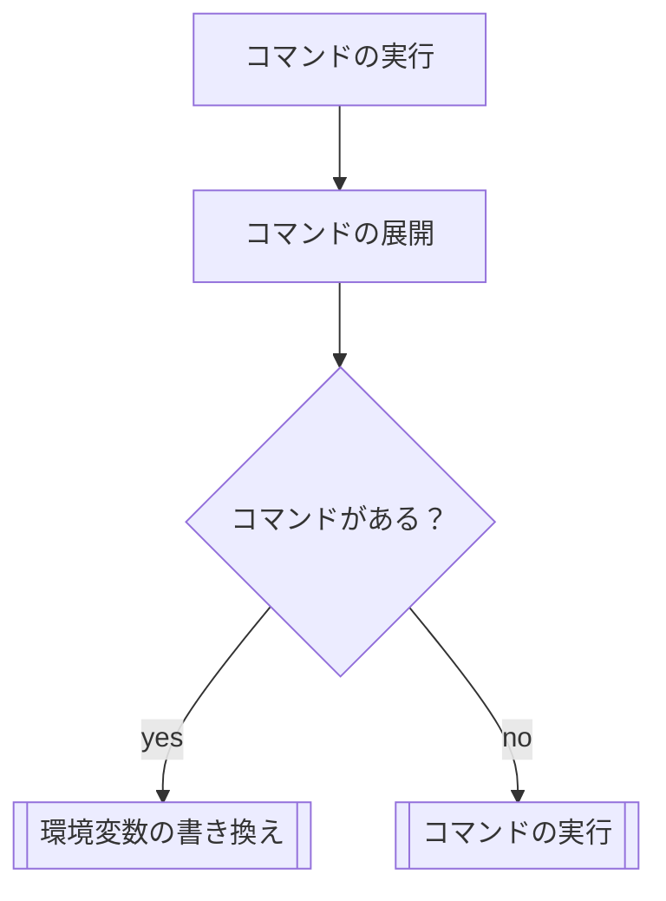
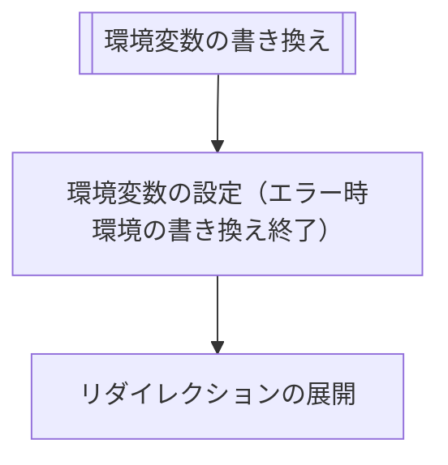
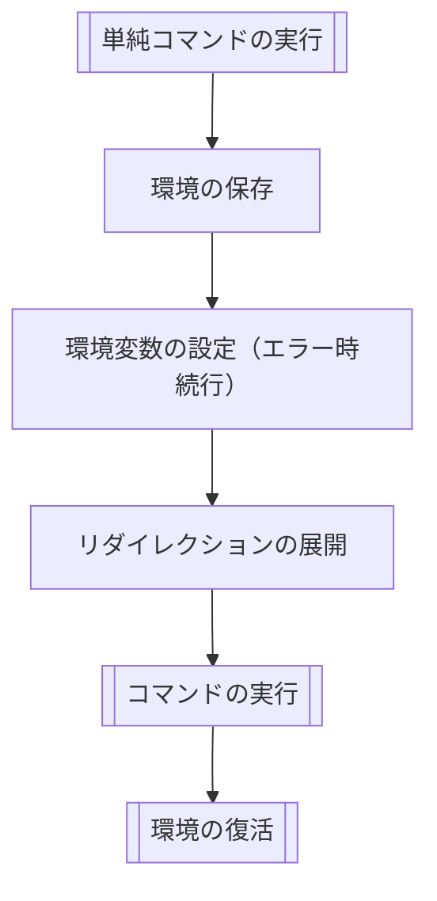

# 単純コマンドの実行
# 宣言
```c
int	ms_command_execution(t_lsa_command *lsa);
```

# 説明
意味解析の結果からコマンドを実行する。
コマンドが存在するときとしないときで共同が異なり、
コマンドがあるときは以下の挙動となる。
1. コマンドの展開
1. FD(0,1,2)と環境変数の保存
1. 環境変数の代入（エラー発生時でも処理を続ける）
1. リダイレクションの実行
1. コマンドの実行
1. FD(0,1,2)と環境変数のリストア

コマンドがないときは以下の挙動となる。
1. 環境変数の代入
1. リダイレクションの実行

各処理はフローのセクションを参考にすること。

# 戻り値
- コマンドの実行の実行ができたとき、`ms_execute_command`関数の戻り値をそのまま返す。
- 環境変数の代入やリダイレクションで失敗して終了する必要があるときは、`1`を返す。
- メモリ不足でエラーが発生したときは、`-1`を返す。

# エラー
- ENOMEM メモリ不足で終了したとき

# フロー
単純コマンドは以下の順に処理が行われる。







# 主な関数

## template ()
 - **宣言**:
 - **説明**:
 - **引数**:
 - **戻り値**
	 - **成功時**: 複製された情報へのポインタ
	 - **失敗時**: NULL
 - **エラー**:
	 - **ENOMEM**: malloc関連のエラー

## ms_save_exec_mement ( 実行環境の保存 )
- **宣言**:
```c
t_environ_memento *ms_save_exec_memento(char *const envp[]);
```
- **説明**:
以下の情報を構造体に複製して保存する。
	* 現在の標準入力のFD
	* 現在の標準出力のFD
	* 現在の標準エラー出力のFD
	* 現在の環境変数

	FDは、dupを使って複製される。
- **戻り値**
	- **成功時**: 複製された情報へのポインタ
	- **失敗時**: NULL
- **エラー**:
  - **ENOMEM**: malloc関連のエラー
  - **EBADF**: dup関連のエラー
  - **EMFILE**: dup関連のエラー
- **構造体**:
```c
// 実行環境の構造体（環境変数とはべつ）
typedef struct s_environ_memento {
	char *const	envp[]; // 環境変数
	int	stdin_fd; // 標準入力のFD
	int	stdout_fd; // 標準出力のFD
	int	stderr_fd; // 標準エラー出力のFD
}	t_environ_memento;
```

## ms_expand_commands (コマンドの展開)
- **宣言**:
```c
char	**ms_expand_commands(t_lsa_word_list **args);
```
- **説明**:
 引数のargsの各要素に対して、展開処理(ms_expansion)を行った結果をNULL終端の配列で返す。
- **引数**:
	- **args**: NULL終端の配列
- **戻り値**
	- **成功時**: NULL終端の配列
	- **失敗時**: NULL
- **エラー**:
  - **ENOMEM**: malloc関連のエラー

 ## ms_has_any_commands (コマンドがあるかどうかの判定)
 - **宣言**:
 ```c

 ```
 - **説明**:
 - **引数**:
 - **戻り値**
	 - **成功時**: 複製された情報へのポインタ
	 - **失敗時**: NULL
 - **エラー**:
	 - **ENOMEM**: malloc関連のエラー

# 補足

### 実行環境の保存
ここでは、環境変数や元のファイルディスクリプタのオープンファイルディスクリプタ情報を保存する。保存されたファイルディスクリプタは10番以降を使用する。

### 2. コマンドの展開
ここでは、リダイレクションでも変数代入でもないワードを展開し、引数として処理します。

### 3. 変数代入の実行
ここでは、順に環境変数に値を設定する。

### 3. コマンドの検索
コマンドと環境変数から

### 2. リダイレクション（ヒアドク含む）の実行
ここでは、リダイレクションするファイルを順に開き、それに対して、入出力のリダイレクションを行う。ヒアドクの処理も同様に行う。

### 4. コマンドの実行
コマンドを実行する。

### 5. 実行環境の復元
コマンドがない場合は、大元の実行環境に現在の環境変数のみを適用させる。（ファイルディスクリプタは適用しない）
コマンドがあった場合は、元の実行環境に戻す。
外部コマンド（execve）の実行が成功したときにはここに来ない。

## 展開

各ワードにに対しては、展開処理が行われる。
この展開処理は以下の処理を順に行った結果となる。結果はNULL終端配列で表される。
1. パラメータと変数の展開
2. パス名展開
