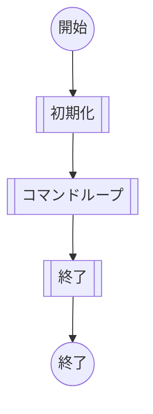
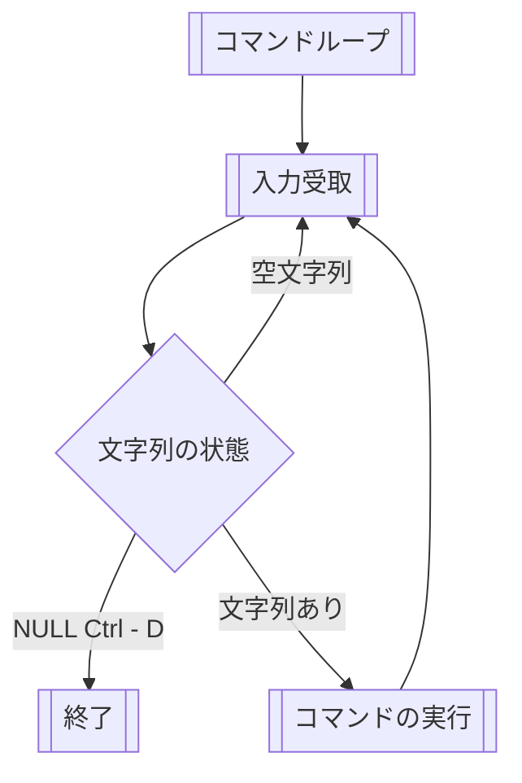

# minishell フロー 概要

```mermaid

flowchart TD

	A((開始))
		--> B[[初期化]]
		--> C[[コマンドループ]]
		--> D[[終了]]
		--> Z((終了))
```

初期化

```mermaid
flowchart TD
	A[[初期化]]
```

コマンドループ

```mermaid
flowchart TD
	A[[コマンドループ]]
		--> B[[入力受取]]
		--> C{文字列の状態}
		C --> |NULL Ctrl - D| D[[終了]]
		C --> |空文字列| B
		C --> |文字列あり| E[[コマンドの実行]] --> B

```

終了

```mermaid
flowchart TD
	A[[終了]]
```
