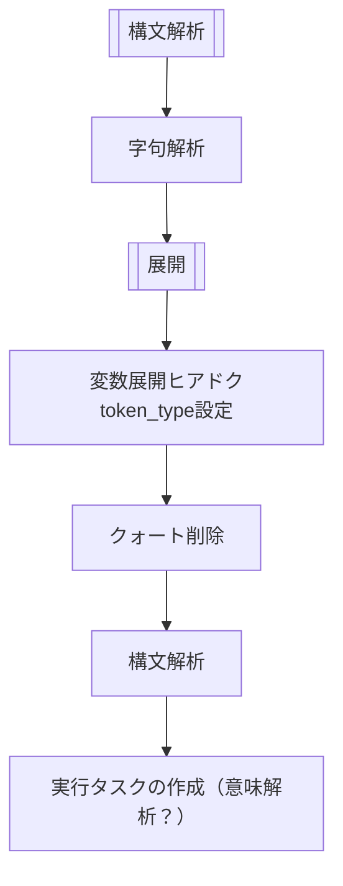
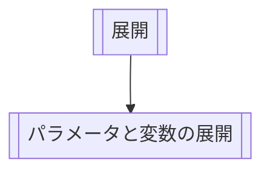
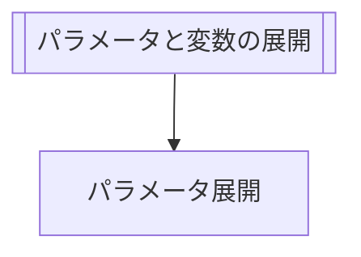

# 構文解析 フロー
構文解析

```mermaid
flowchart TD
	A[[構文解析]]
		--> B[字句解析]
		--> C[[展開]]
		--> D[変数展開ヒアドクtoken_type設定]
		--> E[クォート削除]
		--> F[構文解析]
		--> G[実行タスクの作成（意味解析？）]
```

展開

```mermaid
flowchart TD

    A[[展開]]
	%% --> C[ブレース展開]
	%% --> D[チルダ展開]
	--> E[[パラメータと変数の展開]]
	%% --> F[コマンド置換]
	%% --> G[算術式展開]
	%% --> H[単語の分割]
	%% --> I[パス名展開] %% パスパターンの展開
```

パラメータと変数の展開

```mermaid
flowchart TD
	A[[パラメータと変数の展開]]
		--> B[パラメータ展開]
		%% --> C[コマンド置換]
		%% --> D[算術式展開]
```
