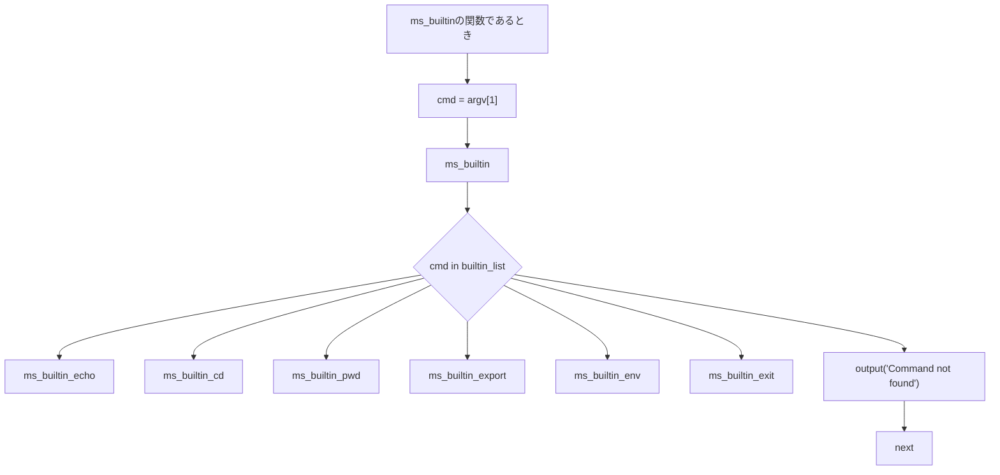

# ビルトインコマンド仕様

## 概要
minishell内部の組み込みコマンドの実装仕様。各関数の引数はexecve(2)に準拠。

```c
int execve(const char *path, char *const argv[], char *const envp[]);
```

### ビルトインで使う内部（シェル）変数
- PWD
- OLDPWD
- CDPATH
- PATH

- **builtin_command_string_list**:
  ```
  ["echo", "cd", "pwd", "export", "unset", "env", "exit"]
  ```

## コマンドフロー


## コマンド一覧

### ms_builtin
```c
int ms_builtin(const char *path, char *const argv[], char *const envp[])
```
- **説明**: argv[0]に対応するビルトイン変数の実行
- **戻り値**:
  - 実行先関数の終了ステータスを返す

### ms_builtin_echo
```c
int ms_builtin_echo(const char *path, char *const argv[], char *const envp[])
```
- **構文**: `echo [arg...]`
- **説明**: argを空白区切りで標準出力に出力し、最後に改行を出力
- **戻り値**: 常に0

### ms_builtin_cd
```c
int ms_builtin_cd(const char *path, char *const argv[], char *const envp[])
```
- **構文**: `cd [相対パス or 絶対パス]`
- **説明**
  - 現在ディレクトリをdirに変更
  - デフォルト：**$HOME**
  - **\$CDPATH**でdirを含むディレクトリの検索パスを定義
  - 引数が"-"であるとき、**$OLDPWD**に移動し、新しいディレクトリの絶対パス名が標準出力に表示される。
- **戻り値**:
  - 成功: 0
  - 失敗: 1　 
- **エラー**:
  - no such file or directory
  - not a directory
  - permission denied (実行権限なし)
  - too many arguments (引数が2個以上)

### ms_builtin_pwd
```c
int ms_builtin_pwd(const char *path, char *const argv[], char *const envp[])
```
- **構文**: `pwd`
- **説明**: 現在の作業ディレクトリの絶対パス名を表示
- **戻り値**:
  - 成功: 0
  - 失敗: 1
- **特記**: カレントのPermissionが000でも動作

### ms_builtin_export
```c
int ms_builtin_export(const char *path, char *const argv[], char *const envp[])
```
- **構文**: `export name=value`
- **説明**: 環境変数を設定または変更
- **戻り値**:
  - 成功: 0
  - 失敗: 1
- **エラー**: invalid identifier (nameに無効な文字が含まれる)

### ms_builtin_unset
```c
int ms_builtin_unset(const char *path, char *const argv[], char *const envp[])
```
- **構文**: `unset variable`
- **説明**: 環境変数を削除
- **戻り値**:
  - 成功: 0
  - 失敗: 1
- **エラー**: invalid identifier (argsに無効な文字が含まれる)

### ms_builtin_env
```c
int ms_builtin_env(const char *path, char *const argv[], char *const envp[])
```
- **構文**: `env`
- **説明**: 現在の環境変数をすべて表示
- **戻り値**: 常に0

### ms_builtin_exit
```c
void ms_builtin_exit(const char *path, char *const argv[], char *const envp[])
```
- **構文**: `exit [status]`
- **説明**: シェルを終了
  - statusが指定された場合: その値を終了ステータスとして使用
  - statusが未指定の場合: 直前のコマンドの終了ステータスを使用
  - エラーの場合：下記のエラーに対応する出力を行い終了処理を行う。
- **エラー**:
  - numeric argument required (statusが数値以外)
  - no such file or directory
  - not a directory
  - permission denied (実行権限なし)
  - too many arguments (引数が2個以上)
- **注意**: finalize処理と関連あり
