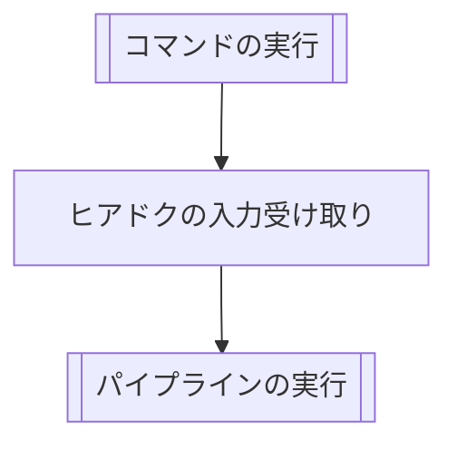
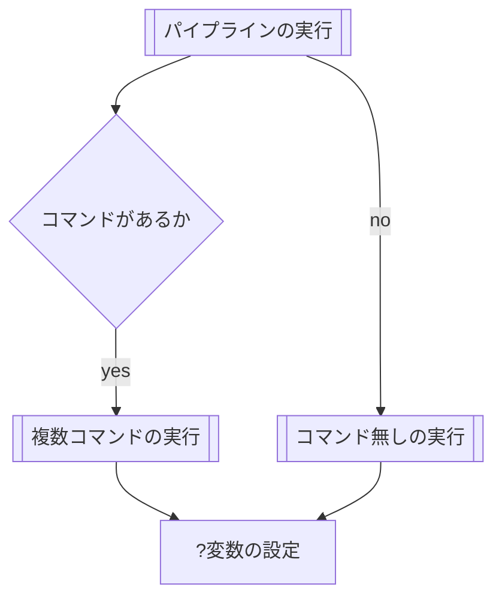
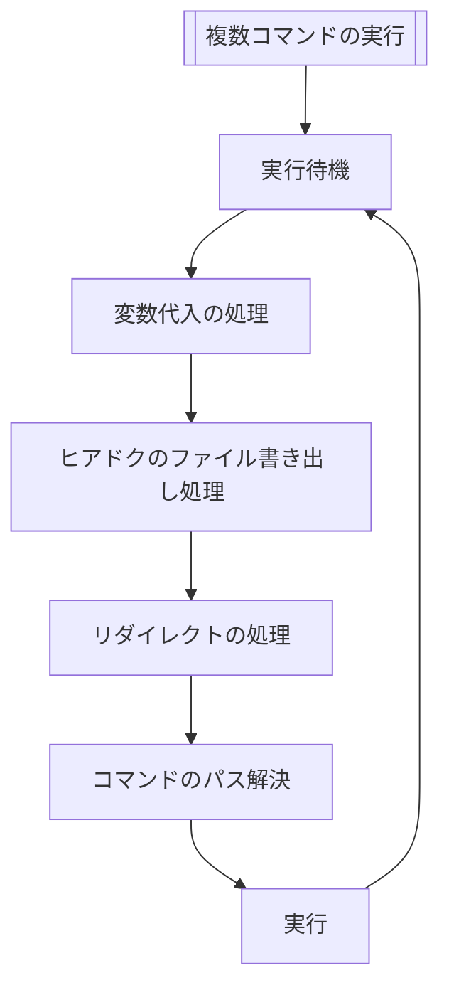
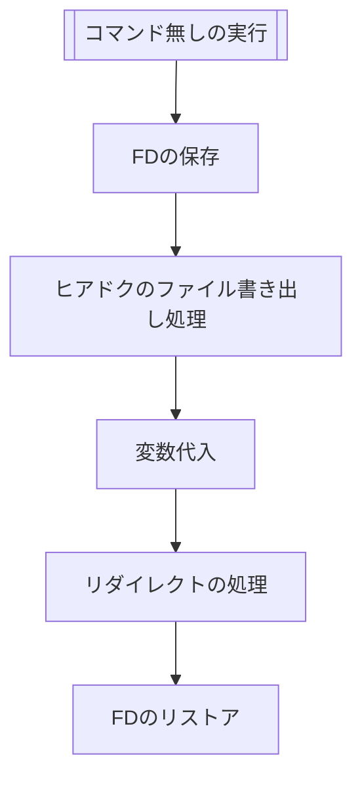

コマンドの実行

```mermaid
flowchart TD
	A[[コマンドの実行]]
		--> C[ヒアドクの入力受け取り]
		--> E[[パイプラインの実行]]
	%% パイプラインは今回は一つ
```

パイプラインの実行

```mermaid
flowchart TD
	A[[パイプラインの実行]]
		--> B{コマンドがあるか}
		--> |yes| C[[複数コマンドの実行]]
		--> E
	A
		--> |no| D[[コマンド無しの実行]]
		--> E
	E[?変数の設定]
```

複数コマンドの実行

```mermaid
flowchart TD
	A[[複数コマンドの実行]]
		--> B[フォーク]
			--> B-0[変数代入の処理]
			--> B-1[ヒアドクのファイル書き出し処理]
			--> B-2[リダイレクトの処理]
			--> B-3[コマンドのパス解決]
			--> B-4[実行]
		--> B[実行待機]
```

コマンド無しの実行

```mermaid
flowchart TD
	A[[コマンド無しの実行]]
		--> D[FDの保存]
		--> E[ヒアドクのファイル書き出し処理]
		--> F[変数代入]
		--> G[リダイレクトの処理]
		--> H[FDのリストア]
```
